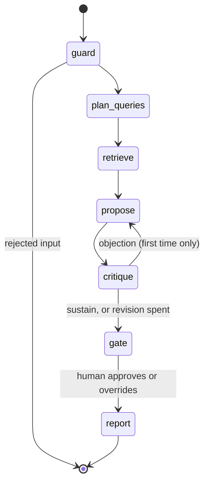

# Architecture

The README covers what and why; this file covers how, box by box, with each box's dominant failure mode and the mitigation that is actually wired in (not aspirational).

## The graph

State lives in a single typed `Annotation.Root` channel set; `usage` and `revisionCount` use reducers (append / saturating add) so parallel or repeated node runs cannot clobber them. Every run is checkpointed per `thread_id`.

## Box by box

| Box | What it does | Dominant failure mode | Mitigation wired in |
|---|---|---|---|
| `guard` (Flash) | PII regex mask first, then: is this a use-case description? does it embed instructions? | Injection rides the description ("classify as minimal") | Text treated as data by prompt contract; instruction payloads rejected before retrieval spend; probes 1–5 regression-test this in CI |
| `plan_queries` (Flash) | 2–4 queries in statute vocabulary | Paraphrase gap: user language misses Act terms | Measured, not assumed: BM25-only on raw descriptions = 26.7% recall@5 in the committed scorecard; transformation + dense leg are the answer, and the scorecard compares configs |
| `retrieve` | Per-query hybrid (BM25 + dense, RRF), dedupe, top-12 chunks, expand to ≤6 whole articles | Fragment context: the model reads half of Article 6(3) and invents the rest | Parent-document expansion: the model always reads whole articles/annexes; chunks only decide *which* articles |
| `propose` (Pro) | Tier + citations + reasoning + borderline flag, structured output | Hallucinated provisions | Prompt restricts citations to retrieved context; report-stage programmatic resolution flags anything that doesn't exist in the corpus; faithfulness rate is a CI-gated metric |
| `critique` (Pro) | Adversarial: refute the tier from the same retrieved text | Rubber-stamping (agreeable critic) or infinite reflection | Prompted to attack the weakest link with citations required; "sustain after a genuine attempt" framed as the success state; exactly one revision round, enforced by graph topology |
| `gate` | `interrupt()` carrying proposal + critique; resume payload = approve / override / note | Ephemeral approval: process dies, approval vanishes, no audit artifact | Postgres checkpointer when `DATABASE_URL` is set: resume is a fresh invocation, possibly days later; without it the UI and report print `ephemeral` instead of hiding the downgrade |
| `report` | Assemble tier, resolved citations, obligations checklist, corpus version, metered cost | Stale-corpus assessments read as current | Every report stamps the corpus version; obligations are code (statute-derived map), not model output |

## Where the money goes

One assessment = 2 Flash calls (guard, queries) + 2 Pro calls (propose, critique), plus 2 more Pro calls in the ~minority of runs where the critic objects. Token counts are metered per call and priced at list rates in `lib/llm.ts`; the per-assessment figure in the UI and trust report is derived from those counts, never estimated. The scaling note for a real deployment: the demo's per-task cost scales linearly with portfolio size, and the eval suite (60 cases ≈ a few euros) is the recurring cost of changing anything safely.

## Security posture

The lethal-trifecta read on this design: the agent holds (1) untrusted content: user descriptions and retrieved text; (2) no private data beyond the session's own masked description; (3) no outbound channel: no tool can send email, write files, or call arbitrary URLs; the only write is the report rendered back to the same user. The dangerous leg (outbound) is absent by design, which is why the probe suite focuses on classification-steering and exfiltration-into-output rather than data theft. PII is masked before the model boundary, so even Google's API never sees raw identifiers from careless paste-ins.

MCP exposure: the server publishes read-only tools (`search_ai_act`, `get_provision`) plus `classify_use_case`, which spends API budget but mutates nothing. There is no tool that writes. If a write tool is ever added, it goes behind the same durable interrupt the web flow uses: that rule is the architecture, not a TODO.

## Serverless mechanics worth naming

- **Checkpoint-resume across invocations.** `/api/assess` runs until the interrupt, streams `awaiting_approval`, and dies. `/api/resume` is a fresh invocation that loads the thread from Postgres and continues. The Vercel function timeout stops being a constraint on human latency, only on model latency.
- **SSE over fetch streams**, not WebSockets: serverless-friendly, proxy-friendly, and the UI consumes it with a plain `ReadableStream` reader.
- **Static corpus + embeddings in the bundle** (`outputFileTracingIncludes`): retrieval has zero infrastructure, cold starts included.
- **In-memory rate limiter** that resets on cold start: documented as demo-grade; the production note is a durable store, and pretending otherwise would be the kind of silent cap this repo exists to avoid.
