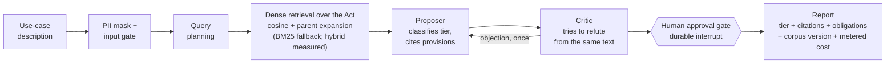

# ai-act-triage

[](https://github.com/nickbiird/ai-act-triage/actions/workflows/ci.yml)

<!-- DEMO — replace docs/demo.gif with your Kap recording (see "Demo & deploy" below); set the live URL after the Vercel deploy. -->


**▶ Try it for free.** The **Run recorded demo** button replays a *real* committed assessment entirely client-side — **no API key, zero model calls** — so you can watch the full pipeline → adversarial critic → durable approval gate → cited report without spending a cent. The live **Assess** path runs the real graph with your own key. **[Live demo →](https://ai-act-triage.vercel.app)** _(URL set after deploy)_

**Describe an AI use case in plain language; get a cited EU AI Act risk-tier classification that has survived an adversarial review and a human approval gate: for cents, in seconds, with the eval scorecard published.**

Triage, not legal advice. That distinction is load-bearing and repeated throughout.

## The problem it solves

A mid-market EU company shipping AI features holds a portfolio of use cases: a support chatbot, a CV screener, a credit model, a predictive-maintenance pipeline. Under Regulation (EU) 2024/1689 (the AI Act), each lands in a different risk tier with very different obligations, and getting one wrong runs from wasted compliance spend up to fines of EUR 35M or 7% of turnover for prohibited practices (Article 99 of the Act, in this repo's corpus). External legal review of a single use case typically runs in the low thousands of euros and takes weeks (treat the EUR 2,000–5,000 used in this README as an order-of-magnitude market figure, not a quoted price), and most of that spend buys wave-throughs, because most use cases are minimal or limited risk.

The expensive question is not "is this legal?". It is **"which of these forty use cases actually deserves the lawyer?"** That is a routing problem, and routing is what this tool does: a cited first-pass tier per use case at cents of metered model cost (the exact per-assessment figure is printed in every report and in the trust report, derived from token counts, never estimated), so the legal budget goes where the risk is. The one case it flags as prohibited pays for every wave-through it screened.

## What it does



1. Personal data in the description is masked before any model call; an input gate rejects instruction payloads.
2. Retrieval queries are planned in the Act's own vocabulary, then run against the full statute text by dense (static Gemini embedding) cosine, expanded to whole articles. The retrieval scorecard measures dense, BM25, and RRF-fused hybrid head-to-head; dense wins on this corpus, so it is the default, with BM25-only as the zero-key fallback and hybrid retained as a selectable, measured config (see [TRUST_REPORT.md](TRUST_REPORT.md) "Retrieval configuration").
3. A proposer model classifies the tier, citing only retrieved provisions.
4. A critic model attempts to **refute** the classification from the same legal text: the way legal positions are actually stress-tested. One revision round, enforced by the graph, not the prompt.
5. The run pauses on a checkpointed `interrupt()` until a human approves or overrides. With Postgres configured, the pause is durable: answer it tomorrow, after a redeploy, from a different serverless instance.
6. The report carries the tier, citations (programmatically resolved against the corpus: invented provisions get flagged, not silently kept), the statutory obligations checklist for that tier, the corpus version stamp, and the metered cost of the run.

The same engine is exposed as an **MCP server** (`/api/mcp`, streamable HTTP), so any MCP client (Claude, Cursor, another agent) can call `search_ai_act`, `get_provision`, and `classify_use_case` as tools. The MCP draft is explicitly **ungated**: a synchronous tool call cannot park on a human approval, so the tool stamps its output `ungated_draft: true` instead of pretending parity with the web flow.

## The numbers

Every number is read from committed eval artifacts (`evals/results/`), regenerated by `npm run evals`, and gated in CI; see **[TRUST_REPORT.md](TRUST_REPORT.md)** for the current scorecard and `/evals` in the app for the rendered version.

The golden set is 60 labelled use cases with a deliberate split: **40 core** cases whose labels fall near-deterministically out of Article 5 / Annex III / Article 50, and **20 contested** cases (Article 6(3) derogations, emotion-recognition edges) labelled against a published rubric ([`evals/golden/RUBRIC.md`](evals/golden/RUBRIC.md)). Accuracy is reported per split because they mean different things: core accuracy measures the system, contested accuracy measures agreement with one documented, non-lawyer reading of genuinely arguable text. Conflating those two numbers is how compliance demos lie; splitting them is the honest alternative.

One measured result worth calling out: BM25-only retrieval on raw use-case descriptions scores **26.7% recall@5** (committed scorecard). That is the paraphrase gap: a product lead writes "imperceptible flicker patterns tuned to lift conversions", the statute says "subliminal techniques beyond a person's consciousness", and it is the measured, not asserted, justification for the dense retrieval leg and the query-transformation stage. The scorecard compares all configs head-to-head once embeddings are generated.

## Run it

```bash
git clone https://github.com/nickbiird/ai-act-triage && cd ai-act-triage
npm ci

# Works with NO API key (committed corpus, deterministic paths):
npm test                  # unit gates: corpus, retrieval, PII rail, obligations
npm run evals:retrieval   # BM25 retrieval scorecard
npx tsx evals/run.ts --replay   # scores committed eval fixtures, zero model calls

# Full pipeline — reasoning defaults to Claude (provider-agnostic):
cp .env.example .env      # add ANTHROPIC_API_KEY (LLM_PROVIDER=anthropic, the default)
                          #   ...or set LLM_PROVIDER=google + GOOGLE_API_KEY for Gemini reasoning
# Dense retrieval is Gemini-only (Anthropic has no embeddings API). With a
# GOOGLE_API_KEY, enable it once; without one, retrieval degrades to BM25-only:
npm run ingest:embed      # one-off: static dense embeddings (costs cents)
npm run dev               # http://localhost:3000

# Reproduce the published numbers:
npm run evals -- --record && npm run evals:retrieval && npm run evals:probes -- --record
npx tsx evals/trust-report.ts
```

Optional: set `DATABASE_URL` (Neon/Supabase free tier) to make the approval gate durable. Without it the gate works but is in-memory: a restart loses pending approvals, the UI says so, and that printed degradation is the point (see the stack table).

## Stack, with the alternative each choice rejected

| Layer | Choice | Rejected alternative, and when it flips |
|---|---|---|
| Orchestration | **LangGraph.js** `StateGraph`: fixed workflow, two model-made decisions (the tier; whether the critique sustains) | A free ReAct agent. Classification has a known procedure; an agent that *might* retrieve loses to a pipeline that *always* does. Flips if the task becomes open-ended research. |
| Arbitration | **Proposer + critic** (one revision max, enforced by graph topology) | Single-shot classification. Cheaper, but it ships unexamined readings; the critic catches missed Annex III hooks and bad derogation claims. Flips for low-stakes, high-volume batch triage. |
| HITL | **`interrupt()` + Postgres checkpointer**: durable pause, approve days later, full audit artifact | An in-process approval prompt (`await input()` with a timeout). Dies with the process, leaves no audit trail, and a timeout that silently returns "no answer" manufactures false confidence. This gap is common in hosted agent platforms; Article 14 makes durability the requirement, not a nicety. |
| Retrieval | **Static Gemini embeddings (dense cosine), in-memory**: the Act is ~2,000 chunks; brute-force cosine is sub-millisecond and the demo needs zero retrieval infra. Hybrid RRF was the original default but the scorecard showed it *underperforms* dense on this corpus (it lets a weak BM25 leg pollute the fusion); BM25 is kept as the zero-key fallback and a measured config, not the default. | pgvector. Right answer at 100k+ chunks or a mutable corpus; this corpus changes only when the Official Journal does. Flips on corpus growth. |
| Chunking | **Structure-aware** (article paragraphs / annex points, parent-document expansion) | Fixed-size windows. Statutes have structure; windows cut Article 6(3) in half. The retrieval scorecard exists to test this claim, not assume it. |
| Models | **Provider-agnostic + tiered** (`LLM_PROVIDER`): Anthropic (Haiku 4.5 gate/queries / Sonnet 4.6 propose/critique) by default, or Gemini (Flash / Pro); temperature 0 on every eval-asserted path | One frontier model everywhere (2–4× the cost for no measured gain on routing/extraction), or fine-tuning (wrong tool: the knowledge lives in the corpus, and the corpus changes by re-ingest, not retraining). The reasoning provider and the embeddings provider are decoupled — only Google offers embeddings, so the dense retrieval leg is Gemini-only; Anthropic-only runs degrade to BM25. |
| Hosting | **Vercel free tier**, SSE streaming, checkpoint-resume across invocations | A persistent VPS. Simpler for long-lived state, but the free-tier constraint forces the durable-checkpoint design to be real instead of decorative. |
| Evals | **Golden set + programmatic scorers in CI** (tier match, citation resolution, retrieval recall, injection probes) | LLM-as-judge for the headline numbers. Judges drift and flatter; every gated metric here is deterministic. A judged metric, if added, gets labelled as judged with its calibration rate. |

## Vendor decoder

Enterprise agent platforms sell these same boxes under proprietary names. The mapping, because primitives outlive product names:

| This repo | Generic primitive | Typical enterprise-platform name |
|---|---|---|
| `StateGraph` workflow + conditional edges | Graph/DAG orchestration | Orchestrator, Flow/Super agents |
| Critic node | LLM-as-judge / evaluation agent | Evaluation agents |
| `interrupt()` + Postgres checkpointer | Durable human-in-the-loop | Human agents, approval flows |
| `/api/mcp` server + tools | Model Context Protocol (open standard) | Tool/connector catalogs, agent hubs |
| PII mask before model calls | Input guardrail | Responsible-AI / trust layers |
| Golden set + CI gates | Eval harness with regression gates | Quality/eval suites |
| Token-metered €/assessment | Cost observability | Usage dashboards |

The buy-vs-build decision is which boxes you rent and which you own, and where your data is allowed to sit while they run.

## What I'd add next

- **Recorded eval fixtures committed** (the `--record` run) so the assessment and probe gates activate in CI: top of the list.
- A demo GIF and screenshots once the live deployment is up.
- GPAI-overlay modelling (Articles 51–56) beyond reasoning-level treatment.
- A real NER PII masker (Presidio-class) behind the same boundary; the regex rail is the placement argument, not the end state.
- Corpus re-ingestion when the 2026 omnibus consolidated text lands in the Official Journal: the version stamp on every assessment exists for exactly that day.

## Honesty card

- Built by a non-lawyer; the contested-split labels are one documented reading, and the rubric is published so you can disagree with it precisely.
- The EUR 2,000–5,000 baseline is a market rate for external single-use-case legal review, cited as context for the routing economics: this tool prices the **routing decision**, not the lawyer.
- The corpus is the OJ text of 13 June 2024; the obligations timeline has moved since (2026 omnibus) and will move again. Version stamps, not pretended currency.
- Legal text source: [artificialintelligenceact.eu](https://artificialintelligenceact.eu) (Future of Life Institute mirror of the public-domain Official Journal text), fetched politely with attribution.

---

Built by [Nicholas Bird](https://github.com/nickbiird), ESADE Business & AI. Related work: [icp-radar](https://github.com/nickbiird/icp-radar) (client-side semantic search over 3,756 EU startups), [mcp-ai-workspace](https://github.com/nickbiird/mcp-ai-workspace) (self-hosted LLM workspace with MCP tooling and measured RAG). This repo is the orchestration layer of that stack: a stateful graph that consumes MCP-shaped tools, pauses for humans, and ships with its own evals.
